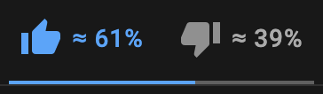
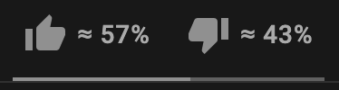
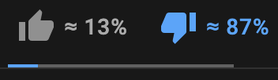

# Show Likes and Dislikes as Percentages

This is a Google Chrome extension for [YouTube](https://www.youtube.com/), that displays viewer sentiment metrics (ie. likes and dislikes) as percentages rather than numbers. 

This was created anticipating YouTube's removal of the dislike count for videos, which can negatively impact viewer experience.

## Installation Guide
1. [Download](https://github.com/xAngad/yt-likes-percentage/archive/refs/heads/main.zip) this repository and extract it, or git clone it using terminal/cmd
2. Go to "chrome://extensions" in the Google Chrome search bar
3. Switch on "Developer Mode" in the top right
4. Click "Load unpacked" on the top left
5. Navigate to the unzipped / cloned repository on your local storage
6. Click on the root folder once, and "Select" in your navigation window
7. Open any [YouTube video](https://www.youtube.com/watch?v=dQw4w9WgXcQ) video to see it work!

If it has any bugs, just reload the page. Something on YouTube's side can add an extra entry to the `sentiments` list, which results in the wrong labels being updated. Reloading returns `sentiments` to its correct length. :grinning:

## Demo 

